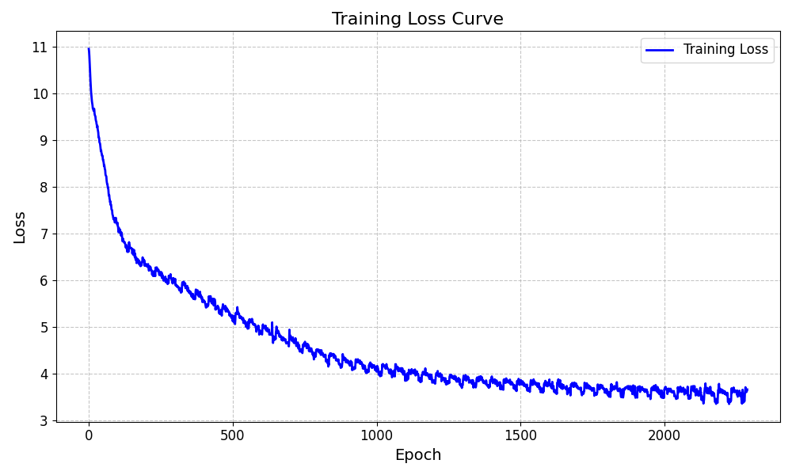

# nanoGPT

复刻 Andrej Karpathy 大神复刻 GPT2

训练数据集和原版复刻项目一样，使用的是 edu_fineweb10B

使用 4090 24g 单卡训练到两千步

HellaSwag accuracy after 2000 steps: 2679/10042=0.2668



生成效果示例（提示词 `"Hello, I'm a lauguage model,"`）

```
> Hello, I'm a lauguage model, and I'd like it to work because some scientists didn't want to talk of the way up
> Hello, I'm a lauguage model, but when I was working on it again, the point seemed like this: "The point here
> Hello, I'm a lauguage model, but I love that if you understand a little English, you don't necessarily know if it's
> Hello, I'm a lauguage model, and how to build a model that doesn't fall under the topic of design and creation. You
> Hello, I'm a lauguage model, a great way to make our first flight for kids – and this is probably the biggest one I
```